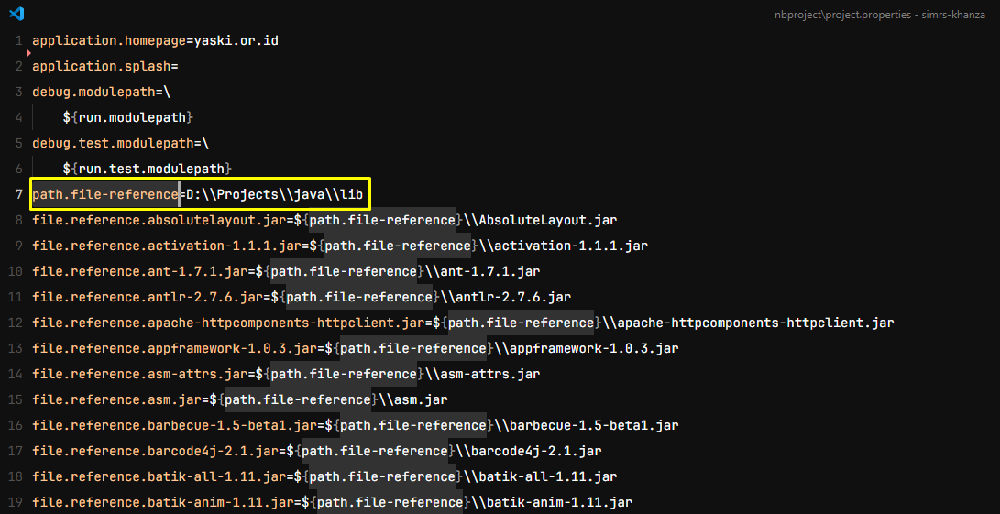
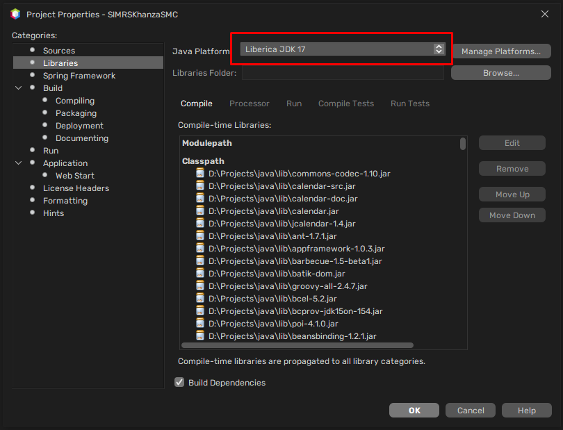
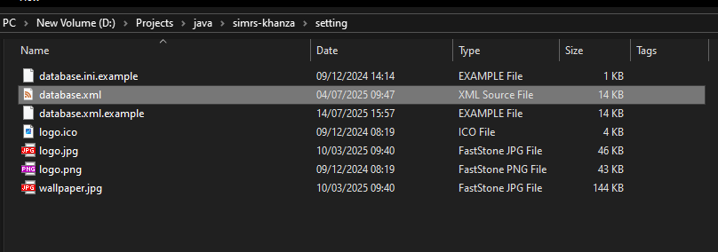
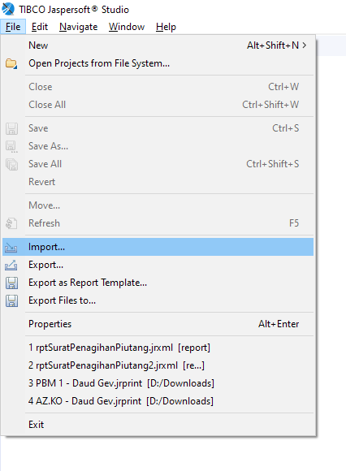
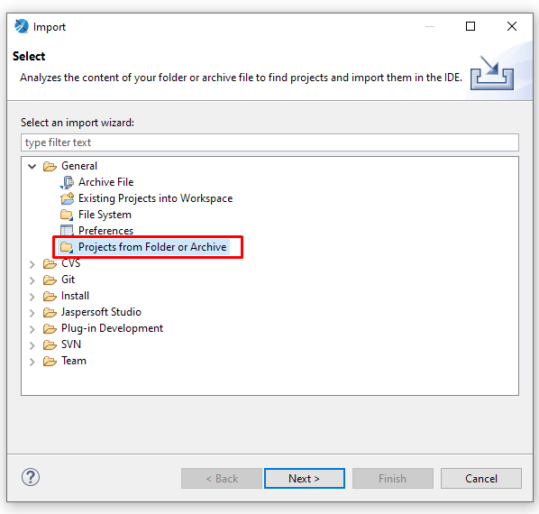
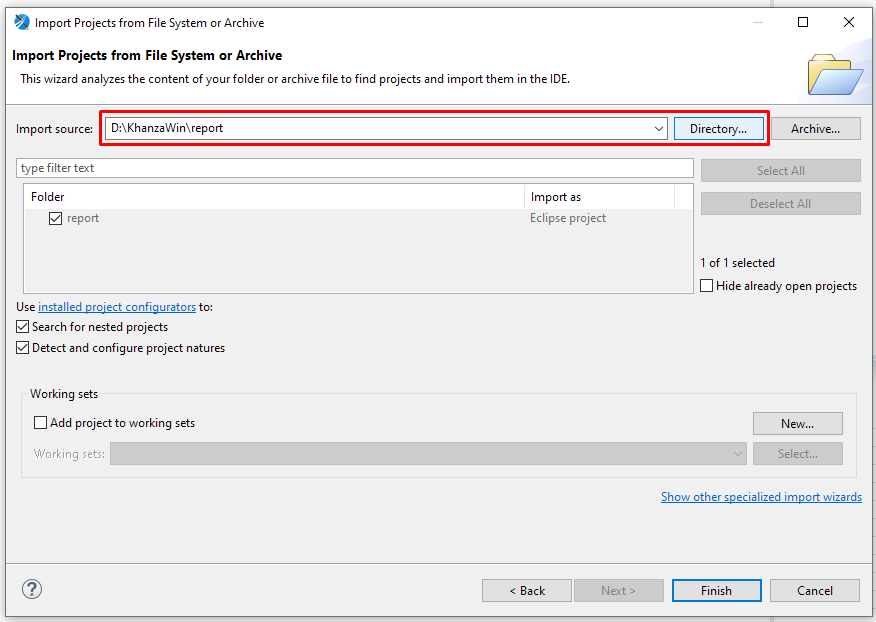
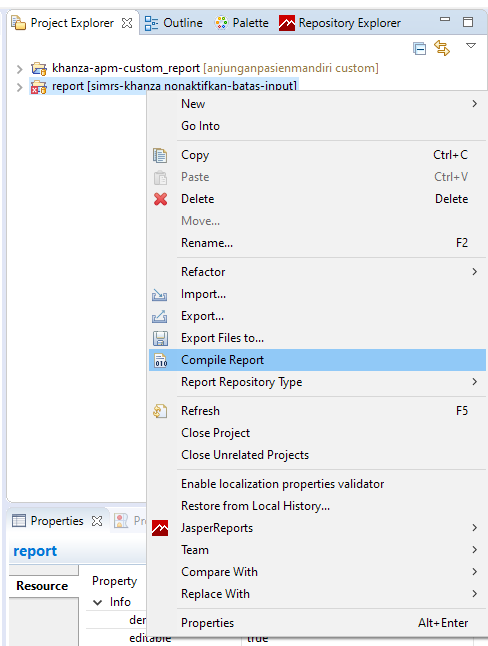
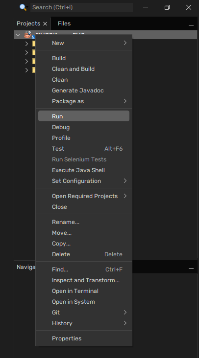

## Overview
Software ini adalah Software Menejemen Rumah Sakit/Klinik/Puskesmas yang gratis, sumber tersedia, dan boleh digunakan siapa saja tanpa dikenai biaya apapun. Hal yang tidak boleh dilakukan adalah memperjualbelikan/mengambil keuntungan dari Software ini dalam bentuk apapun tanpa seijin pembuat software (Khanza.Soft Media).  

## Lisensi
Lisensi yang dianut di software ini adalah [Aladdin Free Public License (AFPL)](https://spdx.org/licenses/Aladdin.html).  

## Panduan
Informasi dan panduan bisa dicek di halaman [wiki](https://github.com/mas-elkhanza/SIMRS-Khanza/wiki).  
Hasil build/Software jadi bisa di download di [Folder drive SIMRS Khanza](https://drive.google.com/drive/folders/0ByL--Jg6bdF7RG1NSlVTT2ZPODg).  

## Donasi
Bagi yang ingin berdonasi untuk pengembangan SIMRS Khanza bisa lewat BSI 1015369872 atas nama Windiarto.  

## Menjalankan Projek
Untuk menjalankan projek, ada beberapa hal yang perlu diketahui.  

### Requirements
- [XAMPP](https://drive.google.com/file/d/1jQd3j16X_fFfS9Sq-7okpdBBD5ng78K_/view?usp=drive_link)  
- [Apache NetBeans <= 27](https://netbeans.apache.org/front/main/download/nb27/)  
- [Liberica JDK 17](https://github.com/bell-sw/Liberica/releases?q=17.0&expanded=true)  
- [Jaspersoft Studio 6.8.0](https://drive.google.com/file/d/1l2jNOd7gqmpQK_7NZBNxmUBLI7IwwKQ3/view?usp=drive_link)  
- Library yang digunakan bisa di [download disini](https://drive.google.com/drive/folders/1bLKuw8l9k5ElC5dxxlrXijACPLtNmCTg?usp=sharing)  

Sebelum memulai setup, pastikan aplikasi-aplikasi ini sudah terinstall dengan baik.  

### Setup
1. Clone repository.  
```bash
git clone https://github.com/Rizky92/simrs-khanza.git --branch=custom "simrs-khanza-smc"
```

> [!NOTE]
> Gunakan flag `--depth=1` setelah `--branch=custom` apabila proses cloning lambat / kendala internet.  
> ```bash
> git clone https://github.com/Rizky92/simrs-khanza.git --branch=custom --depth=1 "simrs-khanza-smc"
> ```

2. Download [Arsip Library](https://drive.google.com/drive/folders/1bLKuw8l9k5ElC5dxxlrXijACPLtNmCTg?usp=sharing) yang digunakan oleh projek ini karena ada beberapa perbedaan dengan library bawaan SIMRS Khanza. Kemudian extract arsip librarynya.  

> [!WARNING]
> Jangan **TUMPANG TINDIH** folder library ini dengan kumpulan library original SIMRS Khanza!  
> 
> Pastikan gunakan folder yang berbeda.  

3. Setelah clone selesai dan library sudah diextract, masuk ke folder projek, kemudian buka file `nbproject/project.properties` menggunakan text editor kemudian cari `path.file-reference`. Ganti nilai ini dengan path ke folder tempat library di extract.  


4. Buka projek dalam Apache NetBeans, kemudian buka properties. Pada bagian library, pastikan `Java Platform` menggunakan [Liberica JDK 17](https://github.com/bell-sw/Liberica/releases?q=17.0&expanded=true).  
  

> [!NOTE]
> Apabila opsi "Liberica JDK 17" tidak ada, silahkan tambahkan dulu sebagai `Java Platform`. Cara menambahkan `Java Platform` bisa dilihat [disini](docs/menambah-jdk.md).  

5. Import `sik.sql` ke database bernama `sik`. Pastikan database dalam keadaan ***KOSONG***. Apabila database belum ada, silahkan buat terlebih dahulu.  
```bash
mysql -u root sik < sik.sql
```

6. Import `sik_modif.sql` ke database bernama `sik`. Ini akan memasukkan semua tambahan dan perubahan pada table `sik`.  
```bash
mysql -u root sik < sik_modif.sql
```

7. Import table `sik_bridging_eklaim.sql` dan `sik_bridging_satusehat.sql` ke database `sik`. Ini akan memasukkan semua data master tambahan yang sebelumnya diimport dari `sik_modif`.
```bash
mysql -u root sik < sik_bridging_eklaim.sql
mysql -u root sik < sik_bridging_satusehat.sql
```

8. Dalam folder projek, masuk ke folder `setting`, copy file `database.xml.example` di tempat menjadi `database.xml`.  


9. Install [Jaspersoft Studio 6.8.0](https://drive.google.com/file/d/1l2jNOd7gqmpQK_7NZBNxmUBLI7IwwKQ3/view?usp=drive_link). Setelah instalasi selesai, buka Jaspersoft Studio, kemudian masuk ke menu `File > Import` dan pilih `Project from Folder or Archive`.  
  


10. Pilih `Directory`, kemudian arahkan ke folder `report` dalam folder projek SIMRS Khanza. Lalu klik `Finish`.  


11. Setelah projek `report` terbuka, klik kanan `report` dan pilih `Compile Report`.  


12. Kembali ke NetBeans. Pastikan projek sudah tidak ada tanda warning. Kemudian klik kanan lalu pilih `Run`.  

