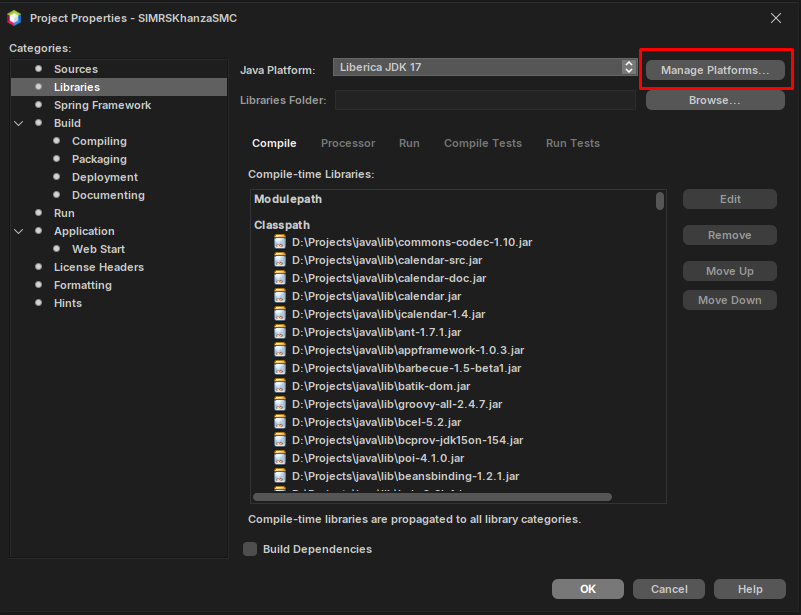
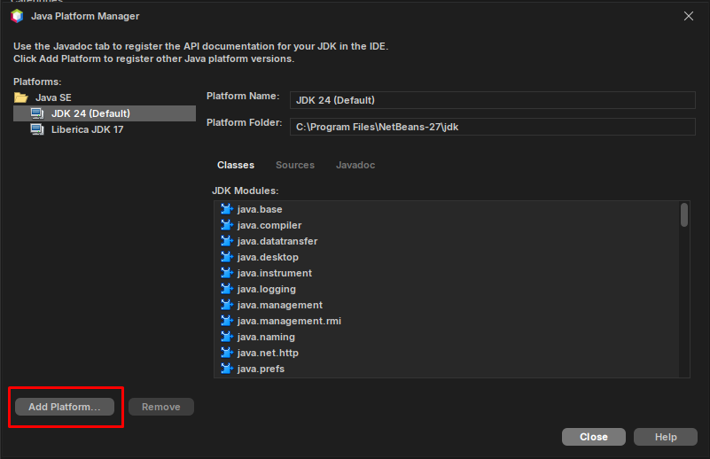
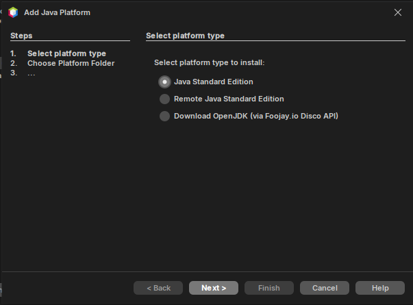
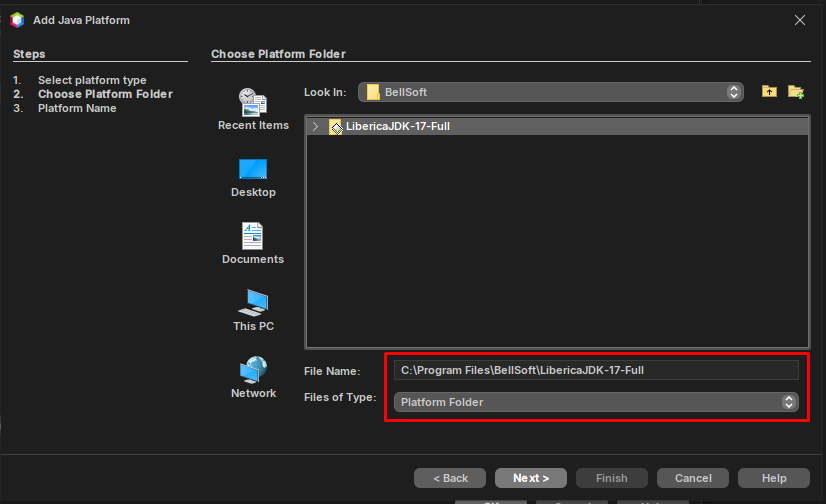
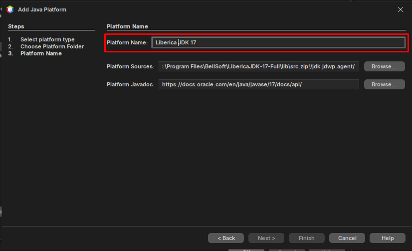
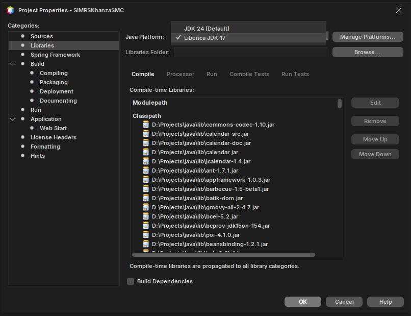

### Menambah Java Platform Liberica JDK 17  

Tutorial ini berasumsi pengguna menginstall dan menggunakan Liberica JDK 17.  

1. Di Project Properties, pada bagian Libraries, klik "Manage Platforms".  
  

2. Klik "Add platform". Akan muncul pop up untuk guide penambahan platform JDK baru.  
  

3. Pada tahap pertama, pilih opsi "Java Standard Edition", kemudian klik "next".  
  

4. Pada tahap berikutnya, cari folder dimana JDK diinstall (untuk Windows, biasanya di `C:\Program Files\BellSoft\Liberica-JDK-XX`). Pilih foldernya, kemudian klik "next".  
  

5. Terakhir, beri nama "Liberica JDK 17", lalu klik "Finish".  
  

6. Liberica JDK 17 telah ditambahkan sebagai Java Platform.
  